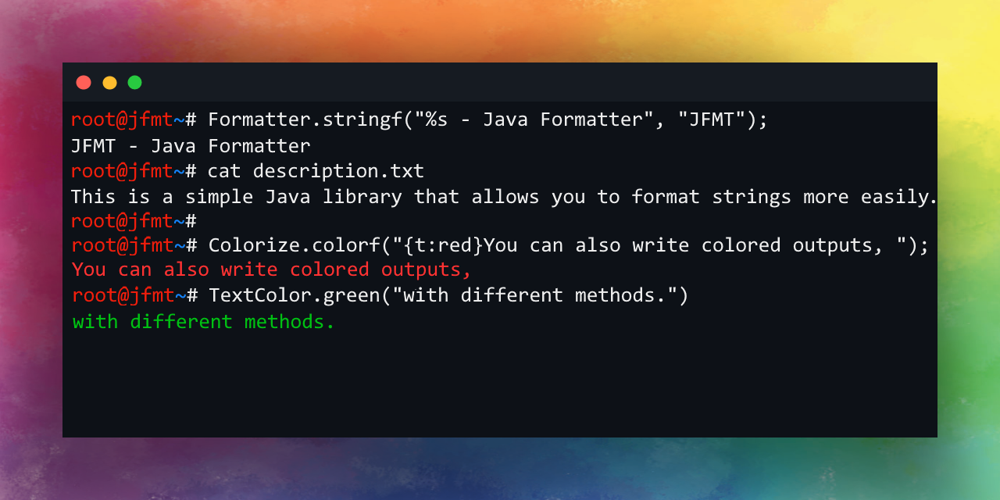

# JFMT - Java Formatter

<hr>

## Table of Contents
- [Formatter](#formatter)<br>
  - [Entities and symbols](#entities-and-symbols)
  - [Format Characters](#format-characters)
    - [Modifying the default date and time format](#you-can-modify-the-default-date-and-time-format)
- [Simple Formatter](#simple-formatter)
- [Colorizing the CLI Text](#colorizing-the-cli-text)
- [256 Color Support](#256-color-support)
- [RGB Colors](#rgb-colors)
- [Formatter Examples](docs/FORMAT-EXAMPLES.md)
- [Colorizing Examples](docs/COLORIZE-EXAMPLES.md)
- [License](#license)

<hr>

## Formatter
The `Formatter.stringf()` method is a function, which provides you the ability to format strings more easily.<br>
It supports [Entities](#entities-and-symbols), [Symbols](#entities-and-symbols), and [Format Characters](#format-characters).
### Entities and symbols
`&n`: Line break<br>
`&N`: Double line break<br>
`&t`: Current time in a default format<br>
`&d`: Current date in a default format<br>
<br>
`$c`: Copyright (©)<br>
`$r`: Registered trademark (®)<br>
`$e`: Element of (∈)<br>
`$p`: N-ary product (∏)<br>
`$s`: N-ary summation (∑)<br>
`$tm`: Trademark (™)<br>
`$Ua`: Upwards Arrow (↑)<br>
`$Da`: Downwards Arrow (↓)<br>
`$La`: Leftwards Arrow (←)<br>
`$Ra`: Rightwards Arrow (→)<br>

### Format Characters
`%v`: Value in the default (`.toString()`) format<br>
`%s`: String in a default format<br>
`%S`: String in uppercase<br>
`%b`: Boolean (**true**/**false**)<br>
`%d`: A round number (if you provide a float or a double, it'll split off everything after the '.')<br>
`%o`: Number in binary<br>
`%f`: A float or a double number<br>
`%f<n>:` A float or a double number rounded to **n** decimal places. (E.g.: `%f3`)<br>
`%r`: String in a reversed format<br>
`%t`: **java.util.Date** format - default is "_yyyy-MM-dd_"<br>
`%a`: List, ArrayList, Set, HashSet in a format like this: [ "element1" "element2" ]

Note: Assign the appropriate type of variable to the characters, otherwise, it will not be formatted.<br>
**For example:**
```java
String result = Formatter.stringf("This is a boolean: %b", "true");
//Result:
//This is a boolean: %b
//Because the passed value is not a boolean but a string.
//To make it work, you want to use it like this:
String result = Formatter.stringf("This is a boolean: %b", true);
```

#### You can modify the default date and time format:
```java
Formatter.setDateFormat("dd-MM-yyyy");
Formatter.setTimeFormat("hh:mm:ss");
Formatter.stringf("Hi %s! Date: &d, Time: &t", "John");
// Result: "Hi John! Date: 03-12-2021, Time: 10:04:43" (ofc with the current date and time)
```

<hr>

## Simple Formatter
The `SimpleFormatter`'s `stringf()` method is easier to use, and it's faster than the `Formatter.stringf()`, but it knows less.<br>
It does not support entities and characters.<br>
If you want to use this method, you pass the arguments like this: "{0}, {1}"<br>
The 0th argument is the first argument, you pass.<br>
You can use it multiple times.<br>
**Example:**
```java
String result = SimpleFormatter.stringf("{0} is {1} years old.", "John", 17);
// Result:
// John is 17 years old.
```
See more examples [here](docs/FORMAT-EXAMPLES.md)

<hr>

## Colorizing the CLI Text
```java
// Method 1: Custom Colored Output
CustomColorFormat ccf = new CustomColorFormat(CustomColorFormat.TColor.BLACK, CustomColorFormat.BgColor.BRIGHT_RED, CustomColorFormat.TDecoration.UNDERLINE);
ccf.println("This is a black underline text with bright red background.");

// Method 2: Simple Formatting
System.out.println(BackgroundColor.red("This is a text with red background."));
System.out.println(BackgroundColor.red(TextColor.yellow("This is a yellow text with red background.")));

// Method 3: Colorize.colorf() function
System.out.println(Colorize.colorf("{t:yellow}This is a yellow text."));
System.out.println(Colorize.colorf("{t:bgreen}This is a green text. {reset}This is a text in default format."));
System.out.println(Colorize.colorf("{bg:bred}This is a text with bright red background."));

// Method 4: Colorize.string() function
System.out.println(Colorize.string("This is a red text.", CustomColorFormat.TColor.RED));
System.out.println(Colorize.string("This is a red text with black background.", CustomColorFormat.TColor.RED, CustomColorFormat.BgColor.BLACK));
System.out.println(Colorize.string("This is a red, underline text with black background.", CustomColorFormat.TColor.RED, CustomColorFormat.BgColor.BLACK, CustomColorFormat.TDecoration.UNDERLINE));
```
See more examples [here](docs/COLORIZE-EXAMPLES.md)

<hr>

## 256 Color Support
```java
// In the constructor, you must provide a number between 0 and 255.
Color256 t = new Text256(200);
t.println("Text");
// Output: Text
// With the ANSI color code of 200

// You can modify the code like this:
t.setCode(201);
t.println("Text2");
// Output: Text2
// With the ANSI color code of 201

// You can use it as background as well:
Color256 t = new Background256(1);
t.println("Text");
// Output: Text
// With the background of code 1

// Random color:
t.random("This is a random colored text.");

// Example:
Color256 t = new Text256(0);
for(int i = 0; i < 256; i++) {
    t.print(i+"   ");
    t.setCode(i);
}
```

<hr>

## RGB Colors
```java
/**
* @param1: Red
* @param2: Green
* @param3: Blue
*/
RgbColor rgb = new RgbColor(255, 0, 0);
rgb.println("Text");
```

<hr>

## License
This library is licensed under the terms of the [MIT License](LICENSE)